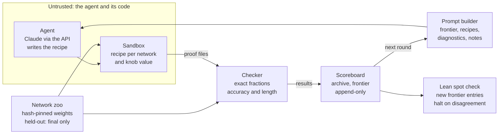

# Build spec: agentic loop for compact proofs

Last updated 9 October 2026.

## 1. Purpose and how to use this spec

Build a general pipeline in which an agent hill-climbs towards shorter and tighter compact proofs for small trained models, and test all of it before any LLM is involved. Nothing is hardcoded: each model lives in its own folder, with its architecture in one Python file and every number in a config file. Switching models means pointing a run config at a different folder.

The first and, for now, only model is `max2`: the max-of-2 network from the [proof-based approach tutorial](https://github.com/LouisYRYJ/Proof_based_approach_tutorial/blob/master/proof_public.ipynb). Its `model.py` is the notebook's `MLP` class. Further models are added later as new folders, without touching the core.

The spec is for a Claude Code session building the pipeline in this repository. Everything except the agent's API call can be built and tested without an API key; a scripted fake agent stands in for the LLM until Step 10.

How to work through it:

- Do the steps in section 6 in order. Each ends with a "done when" check; don't start the next step before it passes.
- Where the notebook and this spec disagree, the notebook is the fact and the spec the intent: report the mismatch to the user with a proposed fix.
- Commit after each step. Push only when the user asks (section 8).

## 2. The loop in one page

One agent writes recipes, a sandbox turns them into proof files, a trusted checker scores them, and the scores feed the next round. The diagram shows one round; the terms follow.



Everything outside the untrusted box is trusted code. The zoo feeds the same weights to the sandbox and to the checker, which loads them itself.

**Terms**

- **Model:** a model family, defined entirely by one folder, `models/<name>/` (section 4): its architecture in `model.py`, its task in `task.py`, its numbers in `config.yaml`, and optional rules of its own. **Network:** one trained instance of a model, i.e. one weight file.
- **Zoo:** a model's networks, trained the same way from different seeds, at one or more size settings.
- **Development networks:** the ones a run may use. **Held-out networks:** used once, after a run, for the reported numbers.
- **Recipe:** a Python program written by the agent that takes one network's weights and returns a proof file. It comes with a circuit claim in plain words.
- **Proof file** (certificate): data, never code. A tree that splits the model's inputs into pieces and applies one rule per piece, with exact-fraction numbers. Its claims are unverified until checked.
- **Rule:** one kind of proof step. Generic rules work for every model and live in the core; a model folder may add its own. Results count as Lean-backed only for rules with a Lean soundness proof.
- **Checker:** trusted code that builds the network from its `model.py`, loads the weights itself, recomputes every claim with exact fractions and rigorous bounds, and outputs certified accuracy and length.
- **Length:** the operations the checker performs, counted by the frozen cost model.
- **Round:** one recipe, run on the development networks at several knob values, then checked and scored. **Run:** many rounds on one model under one run config.
- **Frontier:** per network, the best certified accuracy at each length. **Archive:** every result of a run, append-only.

**One round**

1. The prompt builder assembles the prompt: the fixed part, the current frontier, the best recipes so far, the last attempts with diagnostics, and the agent's notes.
2. The agent backend returns a response; the parser extracts the claim, prediction, knob description, recipe and notes.
3. The runner executes the recipe in the sandbox, once per development network and knob value. Each execution writes one proof file.
4. The checker verifies each proof file and writes results with diagnostics.
5. The archive and frontier update. If the recipe entered the frontier, a Lean spot check runs on one or two networks.

After a run, the final evaluator runs the frontier recipes on the held-out networks, checks every proof in Python and, where the rules have Lean proofs, in Lean, and writes the report.

**Trust boundary.** The agent, its recipes and everything the sandbox outputs are untrusted. The core's checker, cost model and scoring, every model folder, the zoo weights (all hash-pinned) and the Lean proofs are trusted.

**Lean's three roles**

1. Once per rule: a soundness theorem. If the Lean checker accepts a proof file for weights W, the network with weights W has at least the claimed accuracy.
2. During a run: spot checks of new frontier entries, to catch bugs in the Python checker early.
3. After a run: a check of every held-out proof that gets reported.

A model whose rules have no Lean proofs yet (`max2` at first) runs the same loop; its numbers are labelled Python-checked.

**Out of scope for this build:** models other than max2, tools for the agent (it gets one prompt and returns one response), a second agent, and new rules. The prompt collects new-rule ideas, but nothing acts on them yet.

## 3. Design principles

Any part can be replaced or improved without breaking the others or invalidating old results.

- **Nothing is hardcoded.** A model's architecture exists only in its `model.py`; its task, sizes, training settings and split exist only in its folder; run settings exist only in run configs. The core contains no model names, sizes or formulas, and a test enforces it. Adding a model means adding a folder, never editing the core.
- **Files are the interfaces.** Parts communicate only through files with a fixed schema: recipe, proof file, results. Any part can be rewritten without touching the rest.
- **One folder per round, written once.** A round is complete when its DONE marker exists. A run can stop at any point (crash, lost connection, Ctrl-C) and resume without repeating a paid API call.
- **Every result records what produced it:** model folder hash, checker hash, cost model version, rule set version, prompt template version, agent model and config hash. Results from different versions never share a frontier silently.
- **One config file per run** holds every run setting. It is copied into the run folder and hashed.
- **Trusted code is separate.** The core's checker and every model folder are read-only during runs and hash-checked before every check. The sandbox never sees them, apart from read-only copies of `model.py` and the float helpers.
- **Only checked proofs score.** Floating-point analysis may inform the agent but never produces a score.
- **Small before large.** Every component runs on one network before it runs on many.
- **Local only.** Nothing is pushed, uploaded or published unless the user decides to.

## 4. Layout and file contracts

The pipeline is its own repository: a model-agnostic core plus one folder per model. The layout below is the target; adapt names where clearer ones suggest themselves.

```text
Auto-Research-Compact-Proof/
  core/
    loop.py              driver: run, resume, status
    final.py             end-of-run evaluation on held-out networks
    train.py             trains a model's zoo from its folder
    runner.py            runs one recipe on one network and knob, writes one proof file
    archive.py           round folders, archive.jsonl, versions
    scoring.py           frontier and metrics
    report.py            tables and plots from the archive
    check/               trusted, the same for every model
      trace.py           builds the network from model.py and traces it into a graph
      arith.py           exact fractions and rigorous intervals, with operation counting
      proof.py           proof-file schema: the split tree
      rules.py           generic rules: single, interval, contract, symmetry, approximate
      cost.py            the cost model
    agent/
      prompts/           the prompt template, versioned (v1.md, v2.md, ...)
      build_prompt.py    fills the template from the model folder and the archive
      parse.py           splits a response into its sections
      backends/          fake.py, manual.py, api.py
  models/
    max2/
      model.py           the architecture: one torch nn.Module, nothing else
      task.py            input space, labels, groups for diagnostics, description
      config.yaml        sizes, training, seeds, split, zoo path, cost model, hygiene list
      rules.py           the model's own trusted rules (optional; max2 starts with none)
      baselines/         fake-agent responses for round 0
      zoo/               manifest, plus weights if small
      lean/              soundness proofs (optional)
  config/                run configs, committed before a run starts
  results/               curated results; RESULTS.md indexes them
  docs/                  this spec, inventory, cost model, rule notes
  tests/                 includes a stub model folder with a tiny network

Run data lives outside the repository: see "Where things live" below.
```

**Model folder.** Everything model-specific lives in `models/<name>/`, and the core reads nothing else about a model. A run config names the folder.

| File | Contents |
| --- | --- |
| `model.py` | the architecture as one torch `nn.Module` whose constructor takes its sizes as arguments. It is the network's only definition: training, float analysis and the checker all build from it, and the prompt shows its source verbatim. |
| `task.py` | the input space (positions and the values each can take), how an input becomes the module's input tensor, the label function, a cheap check that a set of inputs has one constant label, how diagnostics group inputs, and a one-sentence task description |
| `config.yaml` | module sizes, training settings, seeds, size settings, the development/held-out split, control networks, the zoo path, the cost model version, and the content the prompt must never contain |
| `rules.py` | optional rules of the model's own, each with a soundness argument in `RULES.md`; trusted |
| `baselines/` | fake-agent responses that reproduce known strategies |
| `zoo/manifest` | per network: id, size setting, seed, weight hash, real accuracy, E, B, split; written by `core/train.py` |
| `lean/` | optional soundness proofs, and the command that checks one proof file |

**Recipe.** One Python file defining `make_proof(weights, info, knob)`, which returns a proof as a JSON-serialisable dict.

- `weights`: a dict of numpy float arrays keyed by the parameter names of the model's `model.py`. `info`: the module's sizes from the model's config. `knob`: a float in \[0, 1\] that trades length against accuracy.
- The proof follows the schema in `core/check/proof.py`, with fractions stored as that schema specifies.
- It may import numpy, the standard library, and read-only copies of the model's `model.py` and the core's float helpers, for analysis. Never a checker.
- No network ids, file paths or seeds are passed in.

**Agent response.** Sections with these exact headings, in this order: CLAIM, WHY IT HELPS, PREDICTION, KNOB, RECIPE (one Python code block), NOTES, NEW RULE IDEA (optional). The parser is strict about RECIPE and lenient elsewhere. A missing or unparseable recipe fails the round with status `parse`, which the agent sees next round.

**Round folder.**

```text
round_007/
  prompt.md            the exact prompt sent
  response.md          raw response, saved before parsing
  parsed.json          claim, why, prediction, knob, notes, new_rule_idea
  recipe.py
  proofs/<network>__k<knob>.json
  results.json         one record per network and knob
  meta.json            versions, model, tokens, cost estimate, timings
  DONE                 written last; a round without it is incomplete
```

**Result record**, one per network and knob, in `results.json` and as one line of `archive.jsonl`:

| Field | Meaning |
| --- | --- |
| `model`, `network`, `knob` | which execution this is |
| `status` | ok, parse, crash, timeout, bad\_output |
| `certified_accuracy` | exact fraction and float, counting accepted pieces only |
| `real_accuracy` | from the zoo manifest |
| `length`, `length_by_rule` | total operations, and their split by rule |
| `pieces_accepted`, `rejected` | rejected pieces with rule, reason and shortfall |
| `uncertified_by_group` | per group from the model's `task.py`: correct but uncertified, and wrong |
| `checked_by` | Python, or Python and Lean |
| `runtime_s`, `error` | timing and a truncated error message |
| `versions` | model folder hash, checker hash, cost model, rule set |

The archive is the only source for frontiers and metrics; nothing derived from it is stored as the sole copy.

**Run config**, one YAML file per run: `run_id`, `model` (the model folder), `seed`, `networks` (a subset of the model's development networks; default all), `knob_values`, `runs_dir`, `time_limit_s`, `memory_limit_mb`, `rounds_max`, `patience`, `recipes_per_round`, `screen`, `shown_top_recipes`, `shown_last_attempts`, `backend` (fake, manual or api), `agent_model`, `thinking`, `max_output_tokens`, `api_key_env`, `prompt_template`, `rule_set`, `metric`, `lean_spot_check`. Model settings stay in the model's own `config.yaml`. Defaults are in section 7.

### Where things live

Code and setup live in the repository, run data outside it, and the API key outside both. Everything needed to rerun a run is committed; everything a run produces is kept and never edited.

| What | Where | In git |
| --- | --- | --- |
| Core code, tests | `core/`, `tests/` | yes |
| Model folders: architecture, task, config, rules, baselines, manifest | `models/<name>/` | yes |
| Weight files | the zoo path in the model's `config.yaml`; small ones in `models/<name>/zoo/` | yes, if small |
| Run configs | `config/` | yes, committed before a run starts |
| Lean proofs | `models/<name>/lean/` | yes; build output no |
| Python dependency pins | a pinned requirements or lock file | yes |
| This spec, inventory, cost model, rule notes | `docs/` | yes; once exported, the repository copy of this spec is the authoritative one |
| Raw run data: prompts, responses, recipes, proof files, archive | `<runs_dir>/<run_id>/`, default `~/auto-research-compact-proof-runs/` | no |
| Curated results: reports, plots, held-out numbers | `results/<run_id>/`, indexed in `results/RESULTS.md` | yes |
| API key | a file outside the repository, such as `~/.config/auto-research-compact-proof/env` (permissions 600), in the variable named by `api_key_env` (default `CPL_ANTHROPIC_KEY`) | never |

Rules:

- A run with the API backend starts only from a clean commit. `meta.json` records that commit, so the code, prompt and config behind any number can always be recovered.
- Run folders are append-only. A mistake gets a new run, never an edit.
- After each run, copy its report and final results into `results/<run_id>/`, add a line to `RESULTS.md` (run id, model, commit, config, headline numbers), and commit.
- The key never appears in any file the pipeline writes; a test scans the run folders for it.
- Before a pilot, measure the size of round 0's proof files and multiply out to a full run, to check disk space.
- The code's home is the GitHub repository; push only when the user asks. Raw runs stay local: back them up as compressed copies on a second drive.
- Collaborators clone the repository and use their own API key and their own runs folder.

## 5. Scoring

Every number comes from checked proofs in the archive, first per network, then aggregated per model and size setting. A proof counts only if the checker accepted it under the run's cost model and rule set.

Per network, a(b) is the best certified accuracy among proofs of length at most b. E is the cost of reading and converting the network's weights, and B the length of the proof that checks every input on its own. Both come from the frozen cost model and are stored in the zoo manifest.

- **Q** (default): the area under a(b) on a log length scale, from E to B, normalised to lie between 0 and 1.

```latex
Q = \frac{1}{\ln(B/E)} \int_E^B a(b) \, \frac{db}{b}
```

- **Shortest proof at full accuracy:** the length of the shortest proof that certifies the network's real accuracy.
- **Best accuracy within a budget:** the best certified accuracy within B/10, B/100 and B/1000.
- **Cost of finishing** (alternative): the proof's length plus, for every correct input it leaves uncertified, the brute-force cost of one input (B divided by the number of inputs). Reported as B divided by that total.

Per model and size setting, report the median over networks and the worst network. Every number carries its label: Python-checked or Lean-backed.

The config field `metric` sets which number the agent sees as its score, Q by default. It is frozen for a run; the report always shows all of them.

## 6. Build steps

There are eleven steps, each with a done-when check, and everything up to Step 9 needs no API key. Steps 1 to 9 build the pipeline and test it on `max2`; Step 10 starts the real runs.

### Step 0. Orientation (no code changes)

- Read this spec and the max-of-2 notebook.
- Write `docs/INVENTORY.md`: the notebook's model, training code and proof strategies, and anything in them this spec does not cover.

Done when: `INVENTORY.md` exists and every mismatch with this spec is listed for the user.

### Step 1. Repository and core skeleton

- Fill the repository with the layout in section 4 and a pinned dependency file.
- Write the model-folder loader. It validates a folder against the contract in section 4 and refuses an incomplete one with a clear message.
- Write a stub model folder with a tiny network and a handful of inputs, used only by the core's tests.
- Write the round-folder writer, the archive appender and `meta.json` (commit, dirty flag, versions, model folder hash), with the DONE marker written last.
- Add a test that fails if `core/` names a model or hardcodes a size.

Done when: the core's tests pass against the stub model.

### Step 2. The max2 model folder and the generic trainer

- `models/max2/model.py`: the notebook's `MLP` class, with its sizes as constructor arguments instead of a parameters object. Nothing else goes in the file.
- `models/max2/task.py`: an input is a pair of tokens, encoded as a pair of one-hot vectors; the label is the larger token; diagnostics group inputs by the larger token; plus a one-sentence description.
- `models/max2/config.yaml`: sizes, training settings (the notebook's optimizer, learning rate, batch size and epochs to start), seeds, the split and the zoo path.
- Choose sizes so that brute force is dominated by checking inputs, not by reading the weights. For max2 that means a vocabulary well above the hidden width; otherwise there is little to compress. Propose sizes to the user, and confirm them once Step 3 can compute E and B.
- `core/train.py` trains every seed of a model from its folder alone, measures each network's real accuracy (float brute force through `model.py`), and writes the zoo manifest. The loader verifies weight hashes and refuses held-out networks unless `final.py` calls it with an explicit flag.

Done when: the zoo is trained, real accuracies are reported to the user, the loader tests pass, and changing a size in `config.yaml` retrains without any code change.

### Step 3. Generic checker

- `trace.py` builds the network from `model.py` with the sizes in its config, loads the weights, and traces it with `torch.fx` into a graph. Supported ops start with what max2 uses: linear layers, sums and additions. Others are added when a model needs them. An unsupported op stops the check with the op's name; there is no float fallback.
- `arith.py`: float32 weights are exact dyadic rationals, so they convert to exact fractions, or to integers with a common power-of-two scale. Linear operations are exact; non-polynomial functions, once a model needs them, get rigorous rational lower and upper bounds. Every operation is counted.
- One-hot inputs stay symbolic until the first linear map. A position allowed several tokens then contributes, per coordinate, the minimum and maximum over those tokens' columns, rather than a box that forgets the input is one-hot.
- `proof.py`: a proof file is a split tree. Each internal node splits the current input set by one position's values, or by a node type the model's `rules.py` defines; each leaf applies one rule. The tree makes the leaves a partition of the inputs, so certified accuracy is the share of inputs in accepted leaves.
- Generic rules in `rules.py`, each with a docstring the prompt shows and a soundness argument in `docs/RULES.md`:
  1. `single`: evaluate one input; the label's output must be strictly the largest.
  2. `interval`: interval bounds through the graph over the leaf's whole input set. The label must be constant on the set (checked with `task.py`), and every margin between the label's output and another output must have a positive lower bound.
  3. `contract`: compute the exact product of a chain of linear operations once, for later leaves to use. Charged once.
  4. `symmetry`: if the graph shows that the inputs enter only through a sum over positions, a leaf also certifies every reordering of its inputs.
  5. `approximate`: the proof file supplies a simpler matrix for a contracted product, such as low-rank factors; the checker computes the largest entry of the difference, and later `interval` leaves may use the simpler matrix plus that error.
- `cost.py`, version `cost-v1`: each operation adds its count (a product of an a×b and a b×c matrix adds a·b·c multiplications; interval operations count double), converting the weights adds one per parameter, and reading the proof file adds its size. Document it in `docs/COST_MODEL.md`.
- `models/max2/baselines/`: all `single` (brute force), `single` with `symmetry` (the notebook's symmetry proof), and `contract` with `interval` leaves grouped by the larger token. max2's `rules.py` stays empty, and without Lean proofs its results are labelled Python-checked.

Done when: all-`single` certifies each network's real accuracy, apart from inputs within float rounding of a tie, which are listed; `symmetry` halves the inputs checked; false claims are rejected; the cost function has unit tests; and the checker also works on the stub model, with no model-specific code in `core/`.

### Step 4. Runner, fake agent and round 0

- `core/runner.py`: one recipe, one network, one knob value, in a separate process with wall-clock and memory limits. It passes only the weights, `info` and the knob, plus read-only copies of `model.py` and the float helpers, collects one proof file, and parses it as JSON only (never pickle, never executed).
- `core/agent/backends/fake.py` returns the model folder's `baselines/` responses in order, each in the exact agent response format.
- Add broken responses: one with no RECIPE section, a recipe that raises, one that never ends, one whose proof contains a false claim, and one that returns malformed JSON.
- Write a minimal driver that skips prompt building: for each fake response, parse, run, check and record. Run it on max2's development networks. This is round 0, the baseline frontier.

Done when: the baselines reproduce Step 3's numbers through the whole pipeline, and every broken response gets the right status while the run carries on.

### Step 5. Diagnostics

- Fill the diagnostic fields of the result record: rejected pieces with rule, reason and shortfall; uncertified inputs per group from the model's `task.py`, split into correct-but-uncertified and wrong; length by rule; runtime; truncated errors.
- Optional: per group, the true minimum margin (float) next to the certified one. The agent may see it, but it never scores.
- Write a compact text rendering for the prompt: a few lines per size setting, not per input.

Done when: round-0 diagnostics on max2 show, per larger token, which pairs remain uncertified and why.

### Step 6. Sandbox hardening and adversarial tests

- Run recipes in a container with no network and a read-only filesystem apart from one output directory (Docker or Podman: `--network none --read-only`, a tmpfs for /tmp), with CPU, memory and time limits.
- With no container runtime, fall back to a separate process with `python -I -B`, an empty environment, a fresh temporary working directory and resource limits. Record which mode is in use; the fallback is weaker.
- The core's checker, the model folders and all held-out weights are invisible inside the sandbox; the recipe gets only read-only copies of `model.py` and the float helpers.
- The checker runs in its own clean process from read-only code, with `-B` and `PYTHONDONTWRITEBYTECODE=1`. Trusted files are SHA-256 checked at the start of a run and before every check; a mismatch halts the run.
- The checker loads weights itself by network id. A network named inside a proof file must match it, or the file is rejected. Proof files have a size limit.

Adversarial tests, run against every model, each of which must fail safely:

- a recipe that writes a `.pyc` or any other file into a trusted folder (a hole an earlier audit of a similar pipeline found)
- a recipe that reads held-out weights, or any weights it wasn't given
- a recipe that opens a network connection, or imports a checker or cost model
- a recipe that exceeds the time or memory limit
- proof files with a false claim, overlapping pieces, pieces outside the input space, a rule not in the run's rule set, another network's name, malformed JSON, or an oversized body

Done when: every adversarial test passes. Each hole found later gets its own test here.

### Step 7. Prompt builder and manual mode

- Store the template from Appendix A as `core/agent/prompts/v1.md`.
- `build_prompt.py` fills the model placeholders from the model folder alone: the source of `model.py` verbatim, the description and grouping from `task.py`, the sizes from `config.yaml`, and rule descriptions from the docstrings of the generic rules and the model's own. The per-round placeholders come from the archive: the frontier per size setting, the best recipes, the last attempts with compact diagnostics, and the agent's notes.
- Keep the prompt within a size budget and log its token count; include full code only for the top recipes.
- Information hygiene, enforced by a test: the prompt never contains the content listed in the model's config, held-out network ids or held-out results.
- `manual.py` writes `prompt.md`, tells the user where it is, and waits for `response.md`.

Done when: a prompt built from max2's round 0 reads sensibly to the user, the hygiene test passes, and one manual round works end to end.

### Step 8. Loop driver and API backend

- `loop.py` gets `run --config`, `resume --run` and `status --run`.
- Resume continues after the last round with a DONE marker. In an incomplete round it reuses `response.md` if it exists, so no API call is ever paid for twice.
- Stop at `rounds_max`, or after `patience` rounds without a frontier gain.
- Screening: run on one development network per size setting first, and continue to all of them unless the recipe crashed or certified nothing.
- Lean spot check, for rules with Lean proofs: when a recipe enters the frontier, Lean-check its proof files on one or two development networks. If Lean disagrees with the Python checker, halt the run and report.
- `api.py`: the Anthropic Python SDK, with the agent model and thinking settings from the run config, timeouts and retries with backoff, the raw response saved before parsing, and tokens and estimated cost in `meta.json`. It reads the key from the variable named by `api_key_env` and passes it to the client explicitly. That variable must never be `ANTHROPIC_API_KEY`: Claude Code would pick it up and bill its own work to the key. A spend-limit error halts the run instead of being retried. Test it with a mock; no real call before Step 10.

Done when: a fake-backend run killed mid-round resumes with identical results, and the API backend passes its mock tests.

### Step 9. Reports and final evaluation

- `report.py` builds, from the archive: frontier plots per size setting (accuracy against log length, round-0 baselines included), Q per size setting (median and worst network), the directional targets, cost of finishing, and the claims of the frontier recipes. Output: `report.md` plus images in the run folder.
- `final.py` runs a finished run's frontier recipes on the held-out networks and checks every proof in Python, and in Lean where the rules have Lean proofs. It is the only code path allowed to load held-out networks.

Done when: both work on the max2 fake run.

### Step 10. After the API key (with the user)

1. Smoke test: a cheap model (`claude-haiku-5-5`), 2 or 3 rounds on max2. Plumbing only.
2. Engagement check: 1 or 2 rounds with `claude-fable-5-1`. If it doesn't engage normally with the task, use `claude-opus-5-5`.
3. Cost estimate: tokens per round times planned rounds, shown to the user before any long run.
4. Pilot: about 30 rounds on max2.
5. Full runs, sized from the pilot.

**Parallel track**, any time: Lean soundness proofs for the generic rules, starting with `single`, `symmetry` and `contract`, which need only exact linear algebra.

## 7. Defaults to confirm with the user

Each value lives in a config file, never in code: model settings in `models/<name>/config.yaml`, run settings in `config/<run>.yaml`. These are starting values to confirm with the user before Step 2, and again before the pilots.

| Setting | Default | Lives in |
| --- | --- | --- |
| Model | `max2`, sizes proposed in Step 2 | model config |
| Split | 6 development and 4 held-out per size setting | model config |
| Agent-facing metric | Q; alternative: cost of finishing | run config |
| Pilot | about 30 rounds on max2 | run config |
| Knob values | 0, 0.25, 0.5, 0.75, 1 | run config |
| Rounds per run | 100 to 200, patience 25; set from the pilot | run config |
| Independent runs | 3 | run configs |
| Recipes per round | 1, up to 4 later | run config |
| Time limit | 300 s per network | run config |
| Memory limit | 2 GB per recipe process | run config |
| Shown to the agent | top 3 recipes, last 3 attempts, its notes; fresh context each round | run config |
| Agent model | `claude-fable-5-1`, fallback `claude-opus-5-5`; a cheap model only for plumbing | run config |
| Thinking budget | generous | run config |
| Lean spot check | on frontier entry, 1 or 2 networks; only for rules with Lean proofs, so none for max2 at first | run config |

## 8. Working rules for this session

- Push to GitHub only when the user asks; never publish anything else. If a hook asks to push, decline.
- Put these rules in the repository's `CLAUDE.md`.
- Commit after each step. Never rewrite or delete existing results.
- Ask the user before deleting files or changing the proof-file schema.
- Make no LLM API calls in this build; the fake and manual backends cover everything until Step 10.
- Run small tests before large runs, and keep logs append-only so any run can resume.
- In docs: no em dashes, and keep displayed math short.

## Appendix A: agent prompt template (v1)

Store this as `core/agent/prompts/v1.md`. Braces mark what `build_prompt.py` fills in. `{MODEL_SOURCE}` is the model's `model.py`, verbatim; `{TASK_DESCRIPTION}` and `{GROUPING}` come from its `task.py`; `{SIZE_SETTINGS}` and `{INFO}` from its `config.yaml`; `{RULES_SPEC}` from the docstrings of the generic rules and the model's own; the rest from the run config and the archive. Part 1 is the same every round, and Part 2 is rebuilt each round.

```text
PART 1: SENT EVERY ROUND

You are designing proof strategies for compact proofs (in the sense of
Gross et al., "Compact Proofs of Model Performance via Mechanistic
Interpretability") about small trained models.

GOAL
For each trained network, we want a checked lower bound on its accuracy,
with a proof that is as short as possible. A proof's length is the number
of operations needed to check it. Brute force, checking every input, is
the longest proof. The better you understand how the network computes,
the more checking your proof can skip.

THE NETWORKS
Every network is an instance of this PyTorch module (its full source):
{MODEL_SOURCE}
Task: {TASK_DESCRIPTION}
You are scored on several networks per size setting ({SIZE_SETTINGS}),
all trained the same way from different random seeds. Some are not 100%
accurate, so some of their inputs can never be certified.

WHAT YOU WRITE: A RECIPE
A recipe is a Python function make_proof(weights, info, knob) that
returns a proof file for one network. weights is a dict of numpy arrays
keyed by the module's parameter names; info holds its sizes: {INFO}.
Inside the function you may do anything: floating-point analysis, search,
trial and error. You may import a read-only copy of the module above to
run it in floats. None of that is counted. Only checking the returned
proof file counts.
knob is a number between 0 and 1 that we vary. Use it to trade proof
length against certified accuracy (for example split depth or precision),
so that one recipe traces out a curve.
Start from this template: {TEMPLATE}

PROOF FILES AND RULES
A proof file is a tree that splits the inputs into pieces and applies one
rule to each piece, with specific numbers written as exact fractions.
Only these rules exist: {RULES_SPEC}
The checker rebuilds the network from the module above and the real
weights, and recomputes every claim. A piece that fails is not counted;
the others still are.
What counts towards length: {COST_MODEL}

SCORING
{METRIC}
Some networks are held back and used only at the end. A recipe that
relies on details of particular networks will fail on them.

CONSTRAINTS
- Adapting to each network's weights is fine, but do not hard-code numbers
  taken from particular networks or special-case individual networks.
- Use only the rules listed. If a new kind of rule would help a lot,
  describe it under NEW RULE IDEA; it cannot be used until it has been
  proven correct.
- Each run has {TIME_LIMIT} per network, no internet and no file access.

RETURN EXACTLY THESE SECTIONS
CLAIM: one or two plain sentences on how the network computes its output.
WHY IT HELPS: how the claim lets the proof skip work.
PREDICTION: the certified accuracy and proof length you expect, per size.
KNOB: what the knob controls.
RECIPE: the complete Python file, in one code block.
NOTES: what you learned from the results so far. You will see these
notes again next round.
NEW RULE IDEA: optional.


PART 2: REBUILT EACH ROUND

ROUND {k} OF {K}

SCOREBOARD (best certified accuracy at each proof length, per size
setting, and which recipe holds it):
{FRONTIER}

BEST RECIPES SO FAR (claim, prediction, actual result, code):
{TOP_RECIPES}

YOUR LAST {m} ATTEMPTS (claim, prediction, actual result, diagnostics):
{DIAGNOSTICS}
Diagnostics show, per network: which pieces were rejected and by how much
they missed, which groups of inputs ({GROUPING}) remain uncertified, how
the proof length splits across rule types, and any crash or timeout
message.

YOUR NOTES:
{NOTES}
```
